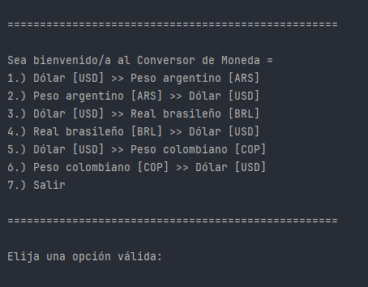

# ConversorDeMonedas-ChallengeOne
Alura One Challenge - Creating a money exchange.

💱 Conversor de Monedas

Aplicación de consola en Java para convertir entre diferentes monedas utilizando tasas de cambio en tiempo real.

✨ Características

-Conversión entre USD, ARS, BRL y COP.\
-Menú interactivo y fácil de usar.\
-Tasas de cambio actualizadas (requiere conexión a internet).

🛠️ Requisitos

-Java 17 o superior\
-Conexión a internet

🚀 Uso

Para ejecutar la aplicación, sigue estos pasos:

1) Clona el repositorio.
2) Compila el proyecto:\
    >javac -d out src/ConversorDeMonedas/main/Main.java
3) Ejecuta la aplicación:\
    >java -cp out ConversorDeMonedas.main.Main
4) Sigue las instrucciones en pantalla para realizar conversiones.

Imagen de ejemplo:

📁 Estructura del Proyecto

>src/ConversorDeMonedas/main/Main.java: Punto de entrada de la aplicación.\
src/ConversorDeMonedas/funciones/ConsultaMoneda.java: Consulta de tasas de cambio vía API.\
src/ConversorDeMonedas/models/: Clases modelo para monedas y tasas de conversión.